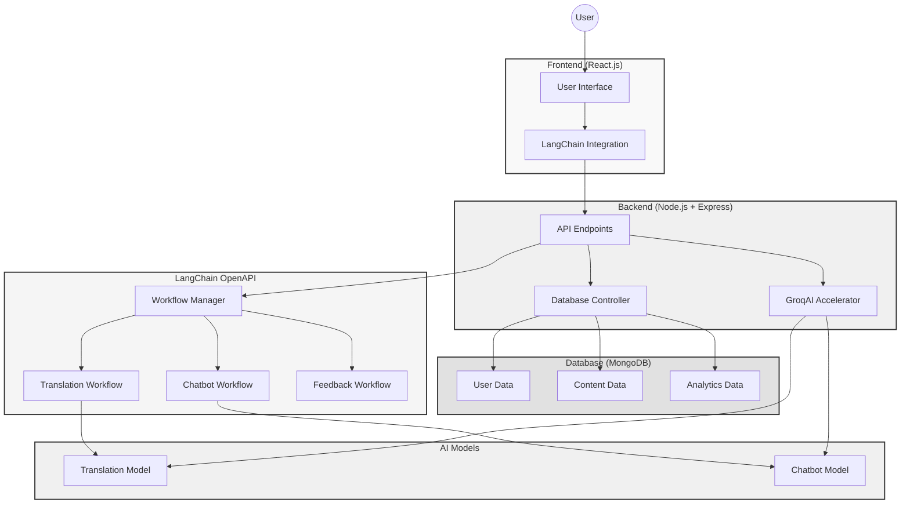
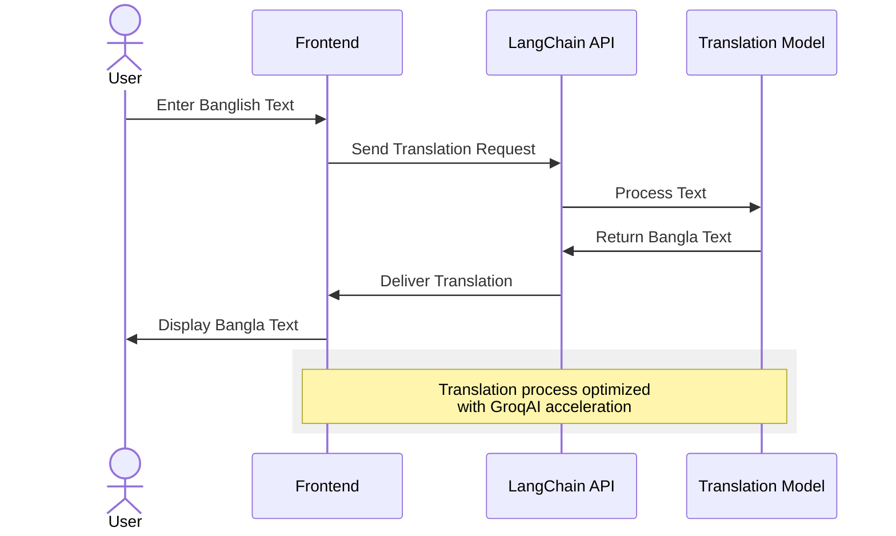
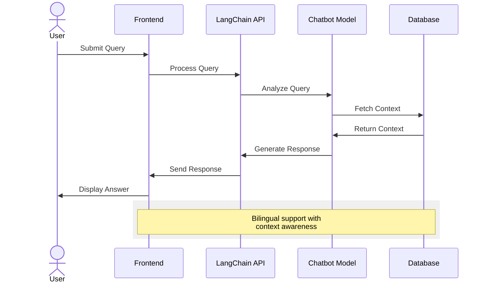
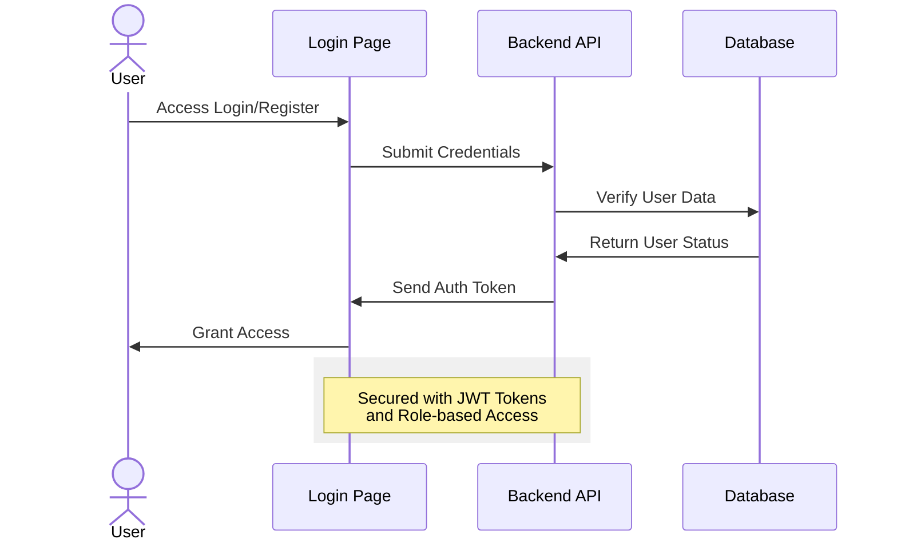
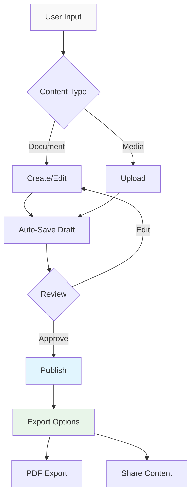
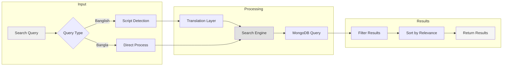
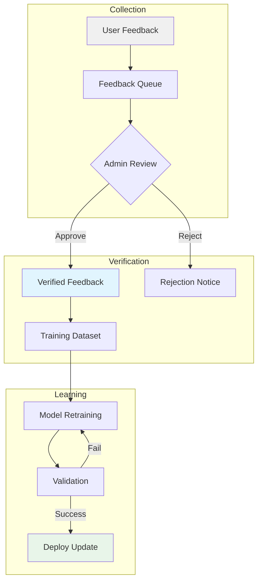

# **Banglish to Bangla Conversion App**

### Empowering seamless communication and cultural preservation through advanced language translation.

---

## **Table of Contents**
1. [Overview](#overview)
2. [Features](#features)
3. [System Architecture](#system-architecture)
4. [Tech Stack](#tech-stack)
5. [Installation](#installation)
6. [Usage](#usage)
   - [Translation Workflow](#translation-workflow)
   - [Chatbot Query Handling](#chatbot-query-handling)
   - [Authentication Flow](#authentication-flow)
   - [Content Management](#content-management)
   - [Search Functionality](#search-functionality)
   - [Feedback and Continuous Learning](#feedback-and-continuous-learning)
7. [Project Structure](#project-structure)
8. [Future Enhancements](#future-enhancements)
9. [Contributing](#contributing)
10. [License](#license)

---

## **Overview**
The Banglish to Bangla Conversion App is a user-friendly platform designed to:
- Convert Banglish text (Bengali written in English script) to Bangla with high accuracy
- Enable users to create, manage, and export content in Bangla
- Provide a chatbot capable of understanding and responding to queries in both Banglish and Bangla
- Continuously improve translation accuracy through user feedback and AI learning

---

## **Features**
### Core Features:
- **Banglish to Bangla Translation**: Real-time, accurate conversion of Banglish text to Bangla
- **Chatbot**: AI-powered chatbot for queries in Banglish and Bangla
- **Content Management**: Create, edit, and export content as customizable PDFs
- **Search Functionality**: Search for user profiles and content using Banglish or Bangla keywords

### Bonus Features:
- **Voice Interaction**: Hands-free content input and chatbot responses
- **Real-Time Collaboration**: Collaborate on content creation with other users
- **Analytics Dashboard**: Insights into user activity and app performance
- **Customizable Bangla Fonts**: Choose fonts for exporting PDFs

---

## **System Architecture**
The app's system architecture integrates multiple components to deliver high performance and scalability.



---

## **Tech Stack**
- **Frontend**: React.js
- **Backend**: Node.js + Express
- **Database**: MongoDB
- **AI Models**:
  - Hugging Face MarianMT (Translation)
  - Hugging Face Conversational Models (Chatbot)
- **Workflow Management**: LangChain OpenAPI
- **Inference Optimization**: GroqAI
- **Containerization**: Docker

---

## **Installation**

### Prerequisites:
- Node.js (v14 or higher)
- MongoDB
- Docker (for containerized deployment)

### Steps:
1. Clone the repository:
   ```bash
   git clone https://github.com/your-repo/banglish-to-bangla.git
   cd banglish-to-bangla
   ```

2. Install dependencies:
   ```bash
   npm install
   ```

3. Set up environment variables:
   ```env
   MONGO_URI=<your-mongo-db-uri>
   LANGCHAIN_API_KEY=<your-langchain-api-key>
   HUGGINGFACE_API_KEY=<your-huggingface-api-key>
   ```

4. Start the development server:
   ```bash
   npm run dev
   ```

Access the app at http://localhost:3000

---

## **Usage**

### Translation Workflow


### Chatbot Query Handling


The chatbot leverages:
- Advanced Natural Language Processing
- Context-aware Response Generation
- Continuous Learning from Interactions

### Authentication Flow


Key Security Features:
- JWT Tokens for secure authentication
- Role-based Access Control
- Session Management and Monitoring

### Content Management


Content Features:
- Document Creation and Editing
- Automatic Draft Saving
- PDF Export with Custom Styling
- Content Sharing and Collaboration

### Search Functionality


Features:
- Intelligent Cross-script Search
- Smart Profile Discovery
- Advanced Content Filtering
- Context-aware Suggestions

### Feedback and Continuous Learning


Process Overview:
- Systematic Feedback Collection
- Admin-driven Quality Control
- Continuous Model Improvement
- Validated Updates Deployment

---

## **Project Structure**
```
banglish-to-bangla/
├── public/                # Static assets
├── src/
│   ├── components/        # React components
│   ├── pages/            # Application pages
│   ├── services/         # API calls and integrations
│   ├── utils/            # Utility functions
│   └── styles/           # CSS and styling
├── server/
│   ├── routes/           # API routes
│   ├── controllers/      # Request handlers
│   ├── models/           # Database models
│   └── config/           # Environment configurations
└── README.md             # Project documentation
```

---

## **Future Enhancements**
- Enhance voice interaction with advanced NLP models
- Add a mobile-friendly interface
- Implement advanced analytics for admin users
- Expand language support options
- Add offline functionality

---

## **Contributing**
1. Fork the repository
2. Create a new branch (`git checkout -b feature-name`)
3. Commit your changes (`git commit -m "Add feature"`)
4. Push to the branch (`git push origin feature-name`)
5. Submit a Pull Request

---

## **License**
This project is licensed under the MIT License. See the [LICENSE](LICENSE) file for details.

---

For questions or support, contact us at: support@banglish2bangla.com